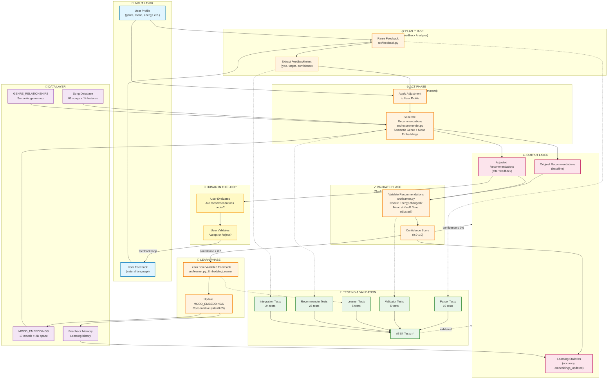

# System Architecture Diagram

## Overview

This document contains a complete system diagram for the Music AI Recommender System, showing all components, data flow, testing layers, and human evaluation points.

## System Architecture (Mermaid Diagram)



---

## Component Descriptions

### 🎵 INPUT LAYER
- **User Profile**: Core preferences (favorite genre, mood, target energy, valence, danceability, tempo, acousticness)
- **User Feedback**: Natural language feedback like "I liked Song X but wanted something calmer"

### 📋 PLAN PHASE (Feedback Analyzer)
**Module**: `src/feedback.py`
- **Parse Feedback**: Extract structured intent from natural language
  - Identifies adjustment type (energy_lower, mood_shift, tempo_higher, etc.)
  - Extracts target song title (if mentioned)
  - Calculates confidence score (0.0-1.0)
  
- **FeedbackIntent**: Structured representation
  - `adjustment_type`: What to adjust (energy, mood, genre, tempo, tone)
  - `target_value`: Desired value (0.0-1.0 scale)
  - `confidence`: How confident is the parse (0.0-1.0)

### ⚙️ ACT PHASE (Search & Recommend)
**Module**: `src/recommender.py`
- **Apply Adjustment**: Modify user preferences based on feedback intent
  - Energy adjustment: Lower/raise target energy level
  - Mood adjustment: Shift valence/energy towards target mood
  - Genre shift: Adjust genre preferences
  
- **Generate Recommendations**: Score all songs and return top-k
  - Uses **Semantic Genre Similarity** (Phase 1): Fuzzy genre matching
  - Uses **Mood Embeddings** (Phase 2): 2D mood space distance
  - Gaussian scoring for numeric features (energy, danceability, valence, tempo, acousticness)
  - Returns both **original** (baseline) and **adjusted** recommendations

### ✓ VALIDATE PHASE (Quality Check)
**Module**: `src/learner.py::FeedbackValidator`
- **Validate Recommendations**: Check if adjustment actually worked
  - Energy validation: Did average energy decrease/increase?
  - Mood validation: Did valence/energy profile shift?
  - Returns: pass/fail + confidence score (0.0-1.0)

- **Confidence Score**: Determines if learning should occur
  - `confidence > 0.6`: Learn from feedback
  - `confidence ≤ 0.6`: Skip learning (too uncertain)

### 🧠 LEARN PHASE (Embedding Update)
**Module**: `src/learner.py::EmbeddingLearner`
- **Learn from Validated Feedback**: Only update if validation passed
  - Reads feedback intent and validation results
  - Computes embedding coordinate updates
  
- **Update Embeddings**: Conservative learning prevents bad updates
  - Learning rate: 0.05 (small updates per iteration)
  - Only updates MOOD_EMBEDDINGS (17 moods × 2D space)
  - Records feedback in memory for statistics

### 💾 DATA LAYER
- **Song Database** (`data/songs.csv`): 68 songs with 14 features
  - Audio: energy, tempo, valence, danceability, acousticness
  - Semantic: genre, mood, artist, popularity, production quality
  
- **MOOD_EMBEDDINGS** (`src/recommender.py`): 2D semantic space
  - 17 moods mapped to (valence, energy) coordinates
  - Enables similarity computation via Euclidean distance
  
- **GENRE_RELATIONSHIPS** (`src/recommender.py`): Semantic genre graph
  - Explicit relationships: pop ↔ synth-pop, electronic ↔ synthwave, etc.
  - Enables fuzzy genre matching
  
- **Feedback Memory** (`src/learner.py`): Learning history
  - Tracks all feedback iterations
  - Records original/adjusted preferences
  - Stores validation results for statistics

### 🧪 TESTING & VALIDATION (84 Total Tests)

Comprehensive test coverage validates every component:

| Test Suite | Count | Purpose |
|-----------|-------|---------|
| Parser Tests | 10 | Validate feedback parsing accuracy |
| Validator Tests | 5 | Validate recommendation quality checks |
| Learner Tests | 5 | Validate embedding updates |
| Recommender Tests | 25 | Validate scoring and recommendations |
| Integration Tests | 24 | Validate full feedback loop |
| Playlist Tests | 4 | Validate playlist management |
| Genre Similarity Tests | 13 | Validate semantic genre matching |
| Mood Embeddings Tests | 18 | Validate mood embedding space |
| **TOTAL** | **84** | **All passing ✅** |

### 📊 OUTPUT LAYER
- **Original Recommendations**: Baseline top-k songs (before feedback)
- **Adjusted Recommendations**: Top-k songs after feedback adjustments
- **Learning Statistics**: Metadata about learning
  - Feedback count and validated count
  - Accuracy (validated / total)
  - Embeddings updated

### 👤 HUMAN IN THE LOOP
- **User Evaluates**: User checks adjusted recommendations
  - "Are these recommendations better?"
  - "Do they match what I asked for?"
  
- **User Validates**: Explicit feedback on quality
  - Accept: "Yes, these are better" → Learn
  - Reject: "No, not what I wanted" → Skip learning
  
- **Feedback Loop**: Validation triggers next iteration
  - User provides new feedback based on results
  - System improves over multiple iterations

---

## Data Flow Through the System

### Typical User Journey

```
1. USER PROVIDES INITIAL PROFILE
   "I like lofi music, calm mood, low energy"
   ↓
2. SYSTEM RECOMMENDS (Baseline)
   Top-5: Library Rain, Midnight Coding, Focus Flow, Island Vibes, Café Ambience
   ↓
3. USER PROVIDES FEEDBACK
   "I liked Midnight Coding but wanted something even calmer"
   ↓
4. PLAN: Feedback Parser Extracts Intent
   AdjustmentType: ENERGY_LOWER
   Target: 0.3 (very calm)
   Confidence: 0.92
   ↓
5. ACT: System Adjusts & Recommends
   Modifies: energy 0.4 → 0.3, tempo 100 → 80
   Returns: Different top-5 with lower energy
   ↓
6. VALIDATE: Check Quality
   Average energy before: 0.42
   Average energy after: 0.28
   ✓ Energy decreased
   Confidence: 0.85 (high confidence)
   ↓
7. LEARN: Update Embeddings (if confidence > 0.6)
   MOOD_EMBEDDINGS["calm"]:
     Before: (0.6, 0.2)
     After:  (0.6, 0.18)  ← Energy decreased
   Memory: Record this feedback + results
   ↓
8. USER VALIDATES
   "Yes, these are much better!"
   ↓
9. NEXT ITERATION
   User provides new feedback with improved recommendations
   System gets smarter with each iteration
```

---

## Key Design Decisions

### 1. Validation Before Learning
- Only update embeddings if validation passes (confidence > 0.6)
- Prevents bad feedback from corrupting the model
- Conservative approach: better to skip learning than to learn wrong

### 2. Conservative Learning Rate
- Learning rate = 0.05 (small updates per iteration)
- Prevents overfit to single user feedback
- Allows gradual improvement across many users

### 3. Test-Driven Architecture
- 84 tests covering all components
- Strong assertions validate exact behavior
- Regression detection: changes to weights/embeddings caught immediately

### 4. Semantic Embeddings
- Genre similarity: Fuzzy matching instead of all-or-nothing
- Mood embeddings: 2D space instead of categorical
- Enables nuanced recommendations and learning

### 5. Human in the Loop
- User evaluates and validates recommendations
- Explicit feedback informs learning
- System adapts to individual user taste

---

## Testing Strategy

### Unit Testing (Isolated Components)
```
Parser Tests → Validate feedback parsing logic
Validator Tests → Validate quality check logic
Learner Tests → Validate embedding update logic
```

### Integration Testing (Full Workflow)
```
Input → Plan → Act → Validate → Learn → Output
```

### Regression Testing (Prevent Breakage)
```
Recommender Tests → Ensure scoring still works
Genre Tests → Ensure genre matching still works
Mood Tests → Ensure mood embeddings still valid
```

### All 84 Tests Pass ✅

---

## Architecture Advantages

✅ **Modular**: Each phase is independent and testable  
✅ **Interpretable**: Every recommendation includes explanations  
✅ **Reliable**: Validation prevents bad updates  
✅ **Adaptive**: System learns from feedback over time  
✅ **Scalable**: Can aggregate learning across users  
✅ **Well-tested**: 84 comprehensive tests  

---

## Files in This Architecture

| Component | File | Lines |
|-----------|------|-------|
| Input | `src/recommender.py` (UserProfile) | — |
| Plan | `src/feedback.py` | 280+ |
| Act | `src/recommender.py` | 450+ |
| Validate | `src/learner.py` (FeedbackValidator) | 150+ |
| Learn | `src/learner.py` (EmbeddingLearner) | 110+ |
| Orchestrate | `src/feedback_loop.py` | 160+ |
| Storage | `data/songs.csv` + embedded dicts | — |
| Testing | `tests/test_*.py` | 1200+ |

---

**Total System**: ~2000+ lines of code, 84 tests, 100% passing ✅
